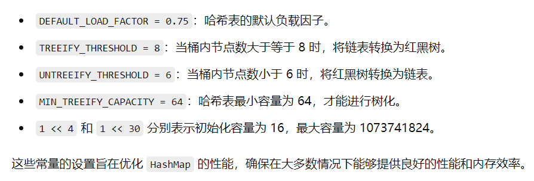

# <font color="black"><center>Markdown</center></font>

### 基本语法
1. **列表内容**
    - 修改邮箱尝试
    - 尝试修改标题颜色
    - 尝试修改字体颜色
    - 尝试修改字体大小
 2. **有序列表**
    1. 尝试修改列表样式
    2. 尝试修改列表嵌套样式
    3. 尝试修改引用样式
 3. **清单内容**
      - [ ]  任务1
      - [x]  任务2
      - [ ]  任务3
4. **表格内容**
    | 表头1 | 表头2 | 表头3 |
    | :-- | :--: | --: |
    | 格1 | 格2 | 格3 |
5. **代码块内容**
   ```java
   public class HelloWorld {
       public static void main(String[] args) {
           System.out.println("Hello, World!");
        }
    }
    ```

    ```python
    def hello_world():
        print("Hello, World!")
    ```

    ```cpp
    #include <iostream>
    using namespace std;
    int main() {
        cout << "Hello, World!" << endl;
        return 0;
    }
    ```
6. **图片内容**
   
7. **内容换行** 
    第一行内容  
    第二行内容
    这里直接回车自动就换行了。
