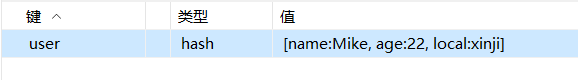
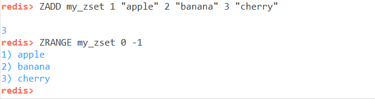

<style>

body {
  counter-reset: h1; 
}

h1 {
    text-align: center;
    font-size: 30px !important;
    counter-reset: h2;
}

h2 {
    font-size: 26px !important;
    counter-reset: h3;
}

h3 {
    font-size: 22px !important;
    text-indent: 1em;
    counter-reset: h4;
}

h4 {
    font-size: 18px !important;
    text-indent: 3em;
    counter-reset: h5;
}

h5 {
    font-size: 14px !important;
    text-indent: 5em;
    counter-reset: h6;
}

h6 {
    font-size: 12px !important;
    text-indent: 8em;
    counter-reset: h7;
}
/* 标题自定义编号 */
h1:before {
  counter-increment: h1;
  content: counter(h1) ". ";
}
h2:before {
  counter-increment: h2;
  content: counter(h1) "." counter(h2) ". ";
}
h3:before {
  counter-increment: h3;
  content: counter(h1) "." counter(h2) "." counter(h3) ". ";
}
h4:before {
  counter-increment: h4;
  content: counter(h1) "." counter(h2) "." counter(h3) "." counter(h4) ". ";
}
h5:before {
  counter-increment: h5;
  content: counter(h1) "." counter(h2) "." counter(h3) "." counter(h4) "." counter(h5) ". ";
}
h6:before {
  counter-increment: h6;
  content: counter(h1) "." counter(h2) "." counter(h3) "." counter(h4) "." counter(h5) "." counter(h6) ". ";
}

/* 正文格式 */
span.article-text{
    display: block;
    font-size: 16px;
    text-indent: 2em;
}
</style>
# 起言
## 目录划分

<span>开始之前先梳理一下思路，目前学习过的东西已经很多了，把这些“八股文”简单的划分一下。</span>

- Java通识
  - Java的基本数据类型
  - 函数修饰符
  - 集合
  - 多线程
  - 异常
  - JVM虚拟机
    - 类加载
- 数据库
  - Mysql
  - Redis
  - MongoDB
- Spring
  - SpringMVC（简略）
  - SpringBoot
  - SpringCloud
- 常用的中间件
  - 消息队列
    - RabbitMQ
    - Kafka
  - 注册中心
    - Nacos
    - Dubbo
  - 搜索中间件
    - Elasticsearch
  - 网关
    - Gateway
    - Nginx
- 设计模式
  - 创建型
  - 结构型
  - 行为型
- 工具
  - Maven
  - Git
  - Jenkins
- 其他提升
  - 数据结构
  - 算法
# Java通识
## Java的基本数据类型
<span  class="article-text">Java的基本数据类型有四种：整数类型、浮点类型、字符类型、布尔类型。</span>

1. 整数类型：byte（1字节）、short（2字节）、int（4字节）、long（8字节）
2. 浮点类型：float (4字节)、double (8字节)
3. 字符类型：char (2字节)
4. 布尔类型：boolean (1字节)

## JDK和JRE的区别
<span class="article-text">JDK全称是Java Development Kit，是Java开发工具包，包含了JRE和编译器javac，调试器jdb，和打包工具jar。</span>

<span class="article-text">JRE全称是Java Runtime Environment，是Java运行环境，包含了JVM和Java核心类库。</span>

## 面向对象
<span class="article-text">面向对象是一种编程范式，将现实世界的物体抽象为对象，对象具有自己的属性以及行为（方法），通过对象之间的交互来实现系统的功能，具有很高的灵活性以及可扩展性</span>

## Java三大特性：封装，继承，多态
<span class="article-text">封装：是指将数据和操作数据的代码封装在一起，对外提供接口，隐藏内部的实现细节，使得外部代码只能通过接口来访问数据，从而实现信息的隐藏和保护。</span>

<span class="article-text">继承：是指一个类可以从另一个类继承其属性和方法，从而扩展自己的功能。</span>

<span class="article-text">多态：同一个接口表现出的不同行为。多态又划分为编译时多态以及运行时多态。</span>

### 编译时多态
<span class="article-text">编译时多态是指在编译阶段就确定了方法的调用对象，根据调用对象不同，选择不同的方法执行。在Java中编译时多态主要是方法重载，在源代码编译成字节码文件的时候，编译器会根据方法签名来选择调用哪个方法。</span>

### 运行时多态
<span class="article-text">运行时多态是指在运行阶段才确定方法的调用对象，根据调用对象不同，选择不同的方法执行。</span>

```java
class Animal{
    void sound(){
        System.out.println("Animal sound");
    }
}

class Dog extends Animal{
    void sound(){
        System.out.println("Dog sound");
    }
}

class Main{
    public static void main(String[] args){
        Animal dog1 = new Dog();
        Dog dog2 = new Dog();
        dog1.sound();
        dog2.sound();
    }
}
```
<span class = "article-text">在上面的代码中，Animal dog1 = new Dog(); dog1的静态类型是（编译时类型）Animal，在编译的时候编译器会检查Animal中是否有sound方法，如果有则选择该方法，如果没有则报错。在运行的时候，JVM根据变量引用的动态类型（运行时类型）也就是实际类型来决定调用哪个方法，dog1的实际类型是Dog，所以调用的实际方法是Dog的sound方法。这个就是运行时多态，在运行的时候才确定方法的调用对象。</span>
<span class="article-text">在上述代码中的两个dog对象是不一样的，对于dog1来说，他可以访问的方法是Animal中的非私有方法或者是Dog中已经**重写**的方法，而对于dog2来说，他可以访问的方法是Animal中非私有可以继承过来的方法以及Dog中独有的方法。</span>

## Java反射机制
<span class = "article-text">允许在运行时动态的获取类的内容，举例类似于的操作 BeanUtils.copyProperties</span>

```java
      // 源对象
      public class UserDTO {
         private String name;
         private int age;
         // Getter & Setter
      }
      // 目标对象
      public class UserEntity {
         private String name;
         private int age;
         // Getter & Setter
      }
      import java.lang.reflect.Field;

      public class ReflectUtil {
         public static void copyFields(Object source, Object target) {

            Class<?> srcClass = source.getClass();
            Class<?> tgtClass = target.getClass();
            Field[] srcFields = srcClass.getDeclaredFields();
            for (Field srcField : srcFields) {
               try {
                  String fieldName = srcField.getName();
                  Field tgtField = tgtClass.getDeclaredField(fieldName);
                  if (tgtField.getType().equals(srcField.getType())) {
                     srcField.setAccessible(true);
                     tgtField.setAccessible(true);
                     Object value = srcField.get(source);
                     tgtField.set(target, value);
                  }
               } catch (NoSuchFieldException | IllegalAccessException e) {
                  // 如果字段不存在或不可访问，跳过
                  continue;
               }
           }
       }
      }
```

## Java的优势是什么？
1. 跨平台：由于JVM java 虚拟机的存在，可以实现一次编写多次运行。
2. 垃圾回收：Java的 GC 自动实现垃圾回收，不需要人工干预，简化开发过程。
3. 生态：Java的生态非常丰富，有大量的第三方库可以帮助开发者解决问题。
4. 面向对象：Java支持面向对象，可以将现实世界的物体抽象为对象，具有很高的灵活性以及可扩展性。

## 函数修饰符
<span>Java中函数的修饰符有四种：</span>

1. public：公有修饰符，可以被所有类访问
2. private：私有修饰符，只能被同一个类访问
3. protected：受保护修饰符，可以被同一个包内的类访问或者是其他包下的子类访问
4. static：静态修饰符，可以被静态方法、静态变量访问
5. final：最终修饰符，可以被子类继承，不能被修改
6. abstract：抽象修饰符，不能实例化，只能被子类继承
7. synchronized：同步修饰符，可以保证线程安全
8. native：本地修饰符，可以调用本地方法
   
## == 和 equals 的区别
<span class = "article-text">在基本数据类型中只能使用 == 来比较两个对象的内存地址是否一致，不能使用 equals 方法，会直接报错。</span>
<span class = "article-text">equals 在没有重写之前和 == 是相同的，在方法重写之后需要根据equals的具体方法来考虑，对于 == 而言的话，如果是基本数据类型，则比较的是值，如果是引用类型，则比较的是引用地址。</span>

## String、StringBuilder、StringBuffer的区别

1. String：不可变的字符序列，线程安全，效率高，适用于少量字符串的场景。
2. StringBuilder：可变的字符序列，线程不安全，效率高，适用于单线程场景。
3. StringBuffer：可变的字符序列，线程安全，效率低，适用于多线程场景。
         1. 内部使用了 synchronized 关键字，效率低。

## 序列化和反序列化
<span class = "article-text">序列化：将一个对象转换为字节流，字节流可以保存到文件，数据库缓存中，便于传递。</span>

1. 存储用户的设置
2. 存储未付款的订单

<span class = "article-text">反序列化：将字节流转换为一个对象。</span>
1. 从文件中读取用户的设置
2. 从数据库中读取未付款的订单

<span class = "article-text">使用场景：用户将本地设置上传到云端，可以分享给其他用户或者是等待以后再用当前app时可以快捷更改设置。将用户当前的设置存储为文件，然后数据库中保存这个文件

**使用方法**
  1. 要序列化的类必须要实现Serializable接口，该接口是一个标记接口，没有任何方法，但是它是一个标记接口，表示该类可以被序列化。
  2. 默认是序列化成字节序列然后输出成一个文件
  3. 也可以使用JackSon库进行序列化，可以将对象转换成JSON字符串，或者将JSON字符串转换成对象。
    1. 引入依赖：
      ```xml
      <dependency>
          <groupId>com.fasterxml.jackson.core</groupId>
          <artifactId>jackson-databind</artifactId>
          <version>2.13.2</version>
      </dependency>
      ```
   2. 定义一个java类，必须有无参构造函数，不需要实现Serializable接口。
   3. 使用ObjectMapper进行序列化，或者使用writeValueAsString方法将对象转换成JS符串。
   ```java
      Person person = new Person("邸睿泽", 25);
      ObjectMapper mapper = new ObjectMapper();
      // 1. 序列化为 JSON 字符串
      String jsonString = mapper.writeValueAsString(person);
      System.out.println("JSON字符串: " + jsonString);
   ```

   6. 反序列化使用readValue方法将JSON字符串转换成对象。
   ```java
      String jsonString = "{\"name\":\"邸睿泽\",\"age\":25}";
      ObjectMapper mapper = new ObjectMapper();
      // 2. 将 JSON 字符串转换成对象
      Person person = mapper.readValue(jsonString, Person.class);
      System.out.println("Person对象: " + person);
   ```
  这里需要注意的是使用JackSon库进行序列化的结果和tostring输出是不一样的
   
## 接口和抽象类有什么区别
### 接口
<span class = "article-text">接口中只是保存具体的方法名称以及方法参数，没有方法体，接口可以多继承比如接口A实现了方法A，B接口实现了方法B，C接口继承A和B，C接口中定了方法C，这个时候一个类如果要实现接口C的话需要实现A,B,C三个方法，代码如下：</span>

```java
public interface interfaceA{
    public void methodA();
}
public interface interfaceB{
    public void methodB();
}
public interface interfaceC extends interfaceA, interfaceB{
    public void methodC();
}
// 实现接口C
public class classC implements interfaceC{
    public void methodA(){
      sout("methodA");
      }
      public void methodB(){
        sout("methodB");
      }
      public void methodC(){
        sout("methodC");
      }
}
```

### 抽象类
<span class = "article-text">首先明确的一点内容是，抽象类也是一个类！只不过是加上了abstract关键字，抽象类无法被实例化，也就是说无法通过new的方式创建这个抽象类的对象，只能是继承抽象类。

```java
public abstract class Animal{
    // 抽象方法，子类必须要实现
    public abstract void eat();
    // 非抽象方法，子类可以选择是否实现
    public void sleep(){
        System.out.println("Animal sleep");
    }
}

public class Dog extends Animal{
    // 重写抽象父类的抽象方法
    public void eat(){
        System.out.println("Dog eat");
    }
}
```

<span class = article-text>抽象类之间的继承：抽象类可以继承另一个抽象类，但是无法实现多继承，抽象子类可以选择不实现抽象父类中的抽象方法。

```java
// 抽象父类
abstract class Animal {
    abstract void makeSound();  // 抽象方法
    public void eat() {
        System.out.println("正在吃饭...");
    }
}

// 抽象子类继承抽象父类
abstract class Dog extends Animal {
    abstract void guardHouse();  // 新增抽象方法
    // 可以不实现 makeSound()
}

// 普通类继承抽象子类
class Husky extends Dog {
    @Override
    public void makeSound() {
        System.out.println("哈士奇叫：嗷呜～");
    }
    // 这里只需要实现抽象子类的抽象方法 guardHouse()即可
    @Override
    public void guardHouse() {
        System.out.println("哈士奇守家...大概吧？");
    }
}
```
<span class = "article-text">通过上述内容基本就可以对抽象类以及接口有一个合理的了解，在实际开发中，我们应该尽量使用接口而不是抽象类，因为接口更加灵活，可以实现多继承，并且接口可以被多个类实现，而抽象类只能被继承，不能被实例化。


## 继承
<span class = "article-text">这里的问题出现在构造函数上，先说结论，如果父类**只有**一个全参构造函数，那么子类的构造函数必须用super把这个全参的部分调用过来,子类自己写的其余字段可以不加入进去，如下代码所示。

```java
public class Person implements Serializable{
    private String name;
    private int age;

    public Person(String name, int age) {
        this.name = name;
        this.age = age;
    }
}

public class Child extends Person{
    private String address;

    // 这里的地址可写可不写
    public Child(String name, int age, String address) {
        super(name,age);
    }
}
```
<span class = "article-text">如果父类有多个字段，并且存在1个字段，2个字段，以及全参的构造函数，子类可以选择调用父类的构造函数，比如构造函数super(name)

### Java为什么不支持多继承
<span class = "article-text">Java不支持多继承，原因是容易出现钻石问题
<span class = "article-text">比如B和C一起继承了A，D继承了B和C，那么D对于同一个方法，B和C有不同的实现，此时会出现歧义。

#### 追问：接口是否可以多继承
<span class = "article-text">接口可以多继承，因为接口中不包含方法体，只包含方法签名，所以接口可以实现多个接口，但是接口不能继承其他类。

## Java中的参数传递机制
<span class = "article-text">Java中无论是基本数据类型还是引用数据类型统一都是按照**值传递**的</span>
<span class = "article-text">值传递：传递给函数的都是当前变量所存储的值的副本，也就是这个变量实际代表了什么</span>

### 基本数据类型值传递
```java
public void change(int a) {
    a = 10;
}

int x = 5;
change(x);
System.out.println(x);  // 仍然是 5
```
<span class = "article-text">在上述代码中传递的是x，x变量代表的是5，所以在函数中实际是对5进行修改，但是在函数执行完毕后，x的值还是5，因为传递的是副本，并没有影响到原来的变量。</span>

### 引用数据类型值传递
第一种情况
```java
public void change(Person p) {
    p = new Person("Tom", 20);
}

Person p1 = new Person("Jerry", 18);
change(p1);
System.out.println(p1.getName());  // 仍然是 "Jerry"
```
<span class = "article-text">这里在调用change(p1)的时候会向函数内传递p1所代表的内存地址，这个地址会赋值给p，但是p = new Person("Tom", 20);这句话只是创建一个新的Person对象，更改p的指向，并不会改变p1的指向，所以在函数执行完毕后，p1的name仍然是"Jerry"。</span>
第二种情况

```java
public void changeName(Person p) {
    p.name = "Tom";
}

Person person1 = new Person("Jerry");
changeName(person1);
// 会输出Tom
System.out.println(person1.name);  
```
<span class = "article-text">这里传递过去之后，直接把person1内存地址下的name更改了，所以在下方输出的时候才会输出新的值Tom</span>

# JVM
## JVM的内存结构
1. 堆内存：存放对象实例，包括新创建的对象、对象的成员变量，字符串等。
2. 栈内存：存放的是方法的局部变量
3. 方法区（元空间）：类名，静态方法，静态变量
4. 程序计数器：存放当前线程执行的字节码的地址。
5. 本地方法栈：java可以调用非java语言的接口，方法，比如C、C++等，这存放这些接口的栈信息。
## JVM的垃圾回收机制
1. 判断那些对象可以回收
   1. 引用计数法
   2. 根可达性分析 
2. 垃圾回收算法
   1. 标记清除：标记存活对象，清除未标记对象：会产生大量内存碎片，影分配。
   2. 标记整理：标记所有需要回收的对象，然后让所有存活的对象向一端移后直接清理掉端边界以外的内存，主要应用在老年代。
   3. 复制算法：将内存分为两块，每次只使用其中一块，当这一块内存用完将还存活的对象复制到另一块内存上，然后清理掉第一块内存。
   4. 分代收集：根据对象存活周期将内存划分为不同的区域，不同区域采用收集算法。
3. 垃圾回收作用区域：堆内存
   1. 新生代
      1. Eden区
      2. Survivor区
         1. Survivor To区
         2. Survivor From区
   2. 老年代
   3. 元空间
4. 垃圾回收器
   1. Serial垃圾回收器：单线程执行垃圾回收，适用于小数据量的场景。
   2. Parallel Scavenge垃圾回收器：多线程执行垃圾回收，适用于中等数据量的场景。
   3. CMS垃圾回收器：并发标记清除，适用于大数据量的场景。
   4. G1垃圾回收器：基于标记整理算法，适用于大数据量的场景。
   5. ZGC垃圾回收器：基于复制算法，适用于高性能场景。
5. MinorGC
    1. 作用在新生代，可能导致新生代对象晋升老年代   
    2. 触发时机：Eden区满
    3. 标记可以清除的对象，采用根可达性分析法
    4. 复制存存活对象：将伊甸园和Survivor From中存活的对象Survivor To区或者是老年代，如果一个对象在Survivor活了那么也会进入老年代，如果Survivor满了，也是直接进入老年代。
    5. 清空伊甸园和Survivor From区，将Survivor FroSurvivor To区交换
## JVM的类加载机制
1. 类加载过程
  1. 加载
     1. 类加载器通过类的全限定类名找到.class 文件，读入后在方法区中创建 Class 对象
 2. 链接
     1. 验证：确保 class 文件没有安全问题
     2. 准备：给静态变量分配内存，并设置对应的初始值，比如 设置 0，Integer 对应的是 null
    3. 解析：将类方法字段的符号引用转换为直接引用，即内存地址 
 3. 初始化
    1. 赋予静态变量最终值，并执行 static 代码块
## 双亲委派
1. 类加载器：应用类加载器、启动类加载器、扩展类加载器。
2. 双亲委派模型：先让父类加载器加载，父类加载失败再让子类加载。
- 举例：假如需要加载 String 类
- 自定义 ClassLoader 收到请求
               ↓
  先委托给 AppClassLoader（应用类加载器）
               ↓
  再委托给 ExtClassLoader（扩展类加载器）
                ↓
  再委托给 BootstrapClassLoader（启动类加载器）
               ↓
  Bootstrap 找到 rt.jar 中的 String.class → 加载成功，果
  ✅ 自定义 ClassLoader 什么都没做，只有在父类都加载失败时，自定义的类加载器才会起作用。 
- 作用
  - 防止用户自定义的类覆盖核心类
  - 同一个类只会被类加载器加载一次，减少内存的浪费
## JVM调优
1. 堆内存大小：-Xms -Xmx
2. 新生代大小：-XX:NewRatio
3. 老年代大小：-XX:SurvivorRatio
4. 垃圾回收算法：-XX:+UseSerialGC -XX:+UseParallelGC -+UseConcMarkSweepGC
5. 垃圾回收器：-XX:+PrintCommandLineFlags -+PrintGCDetails -XX:+PrintGCTimeStamps -+PrintGCDateStamps -XX:+PrintHeapAtGC -+HeapDumpOnOutOfMemoryError -XX:HeapDumpPath=dump.hprof
6. 优化GC日志：-Xloggc:gc.log -XX:+PrintGCDetails -+PrintGCTimeStamps -XX:+PrintGCDateStamps -+PrintHeapAtGC -XX:+HeapDumpOnOutOfMemoryErr-XX:HeapDumpPath=dump.hprof
# 集合
## Java中集合的种类：

1. List：列表，元素有序、可重复
2. Set：集合，元素无序、不可重复
3. Map：映射，元素是键值对，键不可重复
## ArrayList的扩容机制
<span class = "article-text">如果是初始大小为空，设定初始大小为0，在第一次写入数据的时候会进行扩容到10；如果设定初始为0，那么就执行正常的扩容；当数组没有容量的时候才会扩容，新数组的长度是旧数组1.5倍，（底层代码是new_length = length + length >> 1）先创建新的数组，然后执行复制操作，最后销毁旧的数组，整个扩容完成

## HashMap相关
### HashMap的底层数据结构是什么？
数组+链表+红黑树的结构
### HashMap的扩容机制以及树化机制？
1.  扩容机制：HashMap的默认容量是16，扩容因子是0.75，当实际存储的节点数大于等于0.75 * 16时，就会触发扩容，桶的数量会变成两倍。
2.  树化机制：当一个桶内的键值对达到 8 条之后并且当前桶的数量已经到了 64（历经两次扩容），此时桶内的数据才会由链表的形式转变为红黑树的形式。如果桶内的键值对小于 6，则会重新变成链表结构。
### 重写equals方法要不要重写hashcode方法？
<span class = "article-text">必须要重写hashcode方法。在默认情况下equals方法返回的内容是内存地址的文本，hashCode方法返回的是基于内存地址计算出的整数。如果不重写hashcode方法，就会出现两个对象相同，但是hashCode却不同，导致HashMap的put方法无法将两个对象存入同一个桶内。比如新建两个人对象，一个是23岁的John，另一个是25岁的John，重写equals方法，仅仅比较名称，此时两个人是一样的，但是hashcode是不一样的，与期望相悖。

### HashMap的线程安全问题？
<span class = "article-text">HashMap是线程不安全的，数据的更改过程均没有采用CAS+Synchorinzed机制，导致数据不一致。

### 如何决定数据存入哪一个桶？
<span class = "article-text">最终计算出的哈希值对当前桶的数量取余，余数是几就放在哪一个桶内，桶的编号从0开始。

### 哈希运算是什么样子的？
<span class = "article-text">不同的类哈希运算不同，以String为例，首先将初始哈希值右移16位，然后与默认的哈希值进行异或(相同为0，不同为1)运算，得到新的哈希值。int hash = h ^ (h >>> 16);  

## ConcurrentHashMap相关
### 线程安全的原因：
1. 扩容机制：ConcurrentHashMap使用了CAS和Synchronized锁机程安全的。
2. 读操作是无锁的：节点数据是被Volatile关键字修饰的。
3. 写操作：添加数据的时候如果桶为空，仅仅使用CAS就可以实现线会出现竞争条件。添加数据时如果桶不为空，需要使用Synchronized证线程安全。Synchornized锁会锁住对应的桶链表的第一个节点，全。
4. 删除操作：删除数据时如果桶不为空，需要使用Synchronized锁线程安全。Synchornized锁会锁住对应的桶链表的第一个节点，保证线程安全。
### ConcurrentHashMap的扩容机制：
1. sizeCtl = 0.75 * capacity; // 当前桶数组容量 * 负载因存储的节点数 size >= sizeCtl 时，就会触发扩容；扩容时，将数来的 2 倍。
2. 设置扩容状态sizeCtl = -1; // 负值表示正在扩容
3. 多个线程一起迁移数据
4. 将已经迁移完成的桶设置标记ForwardingNode，并将Forwardingnext指针指向新的数组，然后将ForwardingNode置为null，表示迁移完成。
5. 所有桶迁移完成之后table指向新的数组，sizeCtl = 0，表示扩容完成。
# 多线程
## 线程的创建方式
1. 继承Thread类
2. 实现Runnable接口
3. 实现CallAble接口
4. 通过线程池的方式创建线程
## 自定义线程池
<span class = "article-text">自定义线程需要手动指定对应7个参数

  1. 核心线程数
  2. 最大线程数
  3. 空闲线程存活时间 
  4. 时间单位
  5. 任务队列
  6. 线程工厂
  7. 拒绝策略
     1. 默认：AbortPolicy，直接抛出 RejectedExecutionException 异常止系统正常运行。
     2. CallerRunsPolicy，只用调用者所在线程来运行任务，不会抛出异常。
     3. DiscardOldestPolicy，丢弃队列中等待最久的任务，并执行当前任务。
     4. DiscardPolicy，直接丢弃任务，不做任何处理。
```java
ThreadPoolExecutor executor = new ThreadPoolExecutor(
  5,                       // 核心线程数
  10,                      // 最大线程数
  60L,                     // 空闲线程存活时间
  TimeUnit.SECONDS,        // 时间单位
  new ArrayBlockingQueue<>(200),  // 任务队列
  new ThreadFactory() {    // 线程工厂
     @Override
     public Thread newThread(Runnable r) {
     Thread t = new Thread(r);
     t.setName("custom-thread-" + t.getId());
     return t;
    }
  },
  new ThreadPoolExecutor.CallerRunsPolicy()  // 拒绝策略
 );
 ```
## volatile关键字
<span class = "article-text">volatile关键字是Java提供的一种轻量级的同步机制，用来确保变量的可见性，当一个变量被volatile修饰时，它会强制所有线程都从主内存中读取变量的值，而不会从线程缓存或寄存器中读取，从而可以确保所有线程都能看到该变量的最新值。</span>

## Synchronized关键字
<span class = "article-text">synchronized 关键字包裹的代码块或方法，在同一时刻只能被一个线程执行，保证临界区代码的互斥访问，防止数据竞争。

```java
public class SafeCounter {
    private int count = 0;

    // 使用synchronized关键字修饰方法，保证同一时刻只有一个线程执行increment
    public synchronized void increment() {
        count++;
    }

    // 读取count时也加锁，确保读写一致性
    public synchronized int getCount() {
        return count;
    }

    public static void main(String[] args) throws InterruptedException {
        SafeCounter counter = new SafeCounter();

        // 创建多个线程同时调用increment
        Thread t1 = new Thread(() -> {
            for (int i = 0; i < 10000; i++) {
                counter.increment();
            }
        });

        Thread t2 = new Thread(() -> {
            for (int i = 0; i < 10000; i++) {
                counter.increment();
            }
        });

        t1.start();
        t2.start();
//        主线程调用join挂起自己，直到t1和t2执行完毕
        t1.join();
        t2.join();

        System.out.println("最终计数值：" + counter.getCount()); // 预期是20000
    }
}
```
## CAS 关键字
<span class = "article-text">CAS（Compare And Swap）是一种无锁算法，是一种原子操作，是一种用于多线程编程的技术。CAS算法是通过硬件保证的，通过CAS指令，可以保证一个变量的原子性操作，即对一个变量进行读-修改-写操作，是一个原子操作。
<span class = "article-text">如果当前的值等于旧值，那么就对当前值进行修改，否则什么都不做。这样就可以保障如果在变更值的过程中，其他线程修改了当前值，变更值操作就会失败</span>
**示例**
<span class = "article-text">银行转账余额有1000，想转出500，余下500，但是点击确定之前别的操作已经把余额该到了500，此时就会CAS失败，导致转账失败。

## ConcurrentHashMap为什么是线程安全的
<span class = "article-text">ConcurrentHashMap是线程安全的，原因是它内部使用了CAS和Synchronized锁机制来保证线程安全的。</span>

1. 添加数据的时候如果桶为空，仅仅使用CAS就可以实现线程安全，不会出现竞争条件。
   1. 可能出现两个线程同时往桶内写入数据，如果不使用CAS就会造成两个数据写入同一个位置，导致数据丢失。
2. 添加数据时如果桶不为空，需要使用Synchronized锁机制，保证线程安全。
   1. Synchornized锁会锁住对应的桶链表的第一个节点，保证线程安全。
3. 读操作是无锁的
   1. 节点数据是被Volatile关键字修饰的
4. 删除数据时如果桶不为空，需要使用Synchronized锁机制，保证线程安全。
   1. Synchornized锁会锁住对应的桶链表的第一个节点，保证线程安全。
5. 删除数据时如果桶为空，不需要操作

### ConcurrentHashMap的扩容机制
1. sizeCtl = 0.75 * capacity; // 当前桶数组容量 * 负载因子，当实际存储的节点数 size >= sizeCtl 时，就会触发扩容；扩容时，将数组扩大为原来的 2 倍。
2. 设置扩容状态sizeCtl = -1; // 负值表示正在扩容
3. 多个线程一起迁移数据
4. 将已经迁移完成的桶设置标记ForwardingNode，并将ForwardingNode的next指针指向新的数组，然后将ForwardingNode置为null，表示迁移完成。
5. 所有桶迁移完成之后table指向新的数组，sizeCtl = 0，表示扩容完成。

<span class = "article-text">ConcurrentHashMap内部是数组+链表/红黑树的结构（类似于HashMap），每次只对对应的桶加锁。</span>

## 线程的生命周期
1. 新建状态：线程刚被创建，但还没有开始运行。
2. 就绪状态：线程已经准备好运行，等待CPU分配时间片。
3. 运行状态：线程正在运行，占用CPU资源。
4. 阻塞状态：线程因为某种原因放弃CPU资源，暂时停止运行。
5. 死亡状态：线程已经执行完毕，或者被其他线程终止。

# Mysql
## Mysql 如何定位慢查询

1. 可以使用运维工具比如 Skywalking，可以看到具体某个接口执行情况
2. 使用 Mysql 慢日志的查询，设置 SQL 执行时间，比如说当前 sql 执行超过两秒就记录当前 sql

## SQL 执行很慢如何优化

1. 是否出现了聚合查询，多表查询，查询的数据量是不是很大？

2. 可以使用 Explain 字段来分析对应的 sql，返回的结果中会有几个需要关注的字段

   1. key 和 possible_key，这可以确定当前 sql 使用了哪个索引

   2. extra 字段，这是 mysql 自己给出的建议，这里可以看出当前的 sql 是否需回表

      | extra 内容      | 含义解释                                         |
      | --------------- | ------------------------------------------------ |
      | Using index     | 使用了**覆盖索引**，不需要回表                   |
      | Using where     | 有使用 `WHERE` 条件过滤                          |
      | Using temporary | 用了临时表，通常和 `GROUP BY` 或 `ORDER BY` 有关 |
      | Using filesort  | 表示排序是**通过外部排序实现的**，不是索引排序   |
      | **NULL**        | 表示没有额外操作，通常是个好事（查询很干净）     |

   3. type 字段表示的是 Mysql 访问数据的方式性能从好到坏一般为：

      ```sql
      system > const > eq_ref > ref > range > index > all
      ```

      1. system：表示只有一行数据
      2. const：通过主键或者是唯一索引等值查询，直返会一条结果
      3. eq_ref：每次扫描主表时，子表通过主键或者是唯一索引精确匹配一条记录
      4. ref：通过非唯一索引匹配到若干条记录
      5. range：使用了范围查询
      6. index：遍历了整个索引，索引的全扫描
      7. all：全表扫描，

## 索引是什么？

​<span class = "article-text">索引是为了提高查询效率所建立的一种数据结构组织形式，在不同的数据库中有不同的表现方式，比如说在 Mysql 数据库中常见的 Innodb 是采用 B+树的方式实现的，对于旧版本的 MyISAM 引擎也曾采用 B+树来实现，但是聚簇机制不同。

## 索引的基本类型

<span class = "article-text">Mysql 索引类型包含以下几种：

1. 主键索引（字段值不可以重复）

2. 普通索引（索引字段的值可以重复）

3. 唯一索引（字段值不可以重复）

4. 联合索引（两个字段一起作为一个索引）

   河北+小明 != 安徽+小明

5. 前缀索引（取当前字段的前几个字母）

6. 全文+空间索引（暂时用不到，忽略）

只有主键索引在 B+树中是保存了完整的行数据。

## 索引覆盖

<span class = "article-text">要查询的字段内容是 B+树叶子结点的一部分

- ​ 比如说我们查询全部内容采用主键索引作为依据，这个就是索引覆盖，因为主键索引对应的叶子结点是整行完整数据。
- ​ 如果采用非主键索引，得到结果是只有当前行的主键以及普通索引的值，如果我们要的字段没有那么就要回表

## 索引创建的原则

- 针对数据量特别大的表（10 万条数据以上）；
- 经常作为查询条件的字段，一个或者是多个；
- 在区分度高的字段上创建索引，可以仅仅通过索引就可以定位具体的信息
- 如果是字符串形式的比较长，可以用前缀索引，取字符串的前几个字符
- 尽量使用联合索引——>便于索引覆盖
- 索引并不是越多越好——>上楼（步行，电梯，飞机）方式举例

## 索引失效

- 违反最左索引原则（这个情况只会在多字段索引出现）
  - 如果遵从最左索引，但是跳跃了某一列，这样的话就只有最左索引生效
- 范围查询右边的列，不能使用索引
  - 比如果三个字段的索引，第一个字段是"="，第二个字段是">"，第三个字段不管是什么都会失效
- 不能在索引上进行运算操作
  - 比如说对姓名字段进行截取
- 类型转换失败
  - 当前字段是数字类型，传递值是字符串类型呢
- 以%开始的模糊匹配
  - 如果是放在最后边做模糊匹配的话就可以

## sql 优化经验

1. select 禁止使用 select \*（为了使用覆盖索引，降低回表查询）
2. SQL 语句尽量不要写成索引失效的方法
   1. 避免在 where 字句中对字段进行表达式操作
3. 在联合查询结果的时候使用 union all 来代替 union
   1. 使用 union all 会直接返回两个结果的合集
   2. 使用 union 的话会将重复部分仅返回一个
4. 在进行连接查询的时候尽量使用内连接，而不是用左右连接
   1. 内连接仅仅会返回两个表中都满足匹配标准的内容
   2. LEFT/RIGHT JOIN 会保留主表所有记录，若副表存在一对多关系，极易造成结果集膨胀，甚至影响后续分页、聚合逻辑。
## Mysql 查询
1. 聚合查询
<span class = "article-text">聚合查询通过 group by 来实现，目的是统计某一项信息

```sql
-- 统计每个用户的订单总金额
SELECT user_id, SUM(order_amount)
FROM orders
GROUP BY user_id;
```
<span class = "article-text">聚合索引会查询很慢往往是因为数据量很大，Mysql 内存临时表放不下，然后要写入磁盘，这会导致性能极致下降。

2. 多表查询

<span class = "article-text">通过键的联合来形成一张逻辑表
```sql
-- 查询每个订单的用户姓名和订单金额
SELECT o.id, o.amount, u.username
FROM orders o
JOIN users u ON o.user_id = u.id;
```
<span class = "article-text">多表查询+聚合查询示例

```sql
-- 查询每个用户的总消费金额（需要先关联订单再聚合）
SELECT u.username, SUM(o.amount) AS total_spent
FROM users u
JOIN orders o ON u.id = o.user_id
GROUP BY u.id, u.username;
```

3. 深度分页查询
<span class = "article-text">深度分页查询就是分页去查询很后边的数据。

```sql
SELECT *
FROM your_table
ORDER BY id
LIMIT 89990, 10;
```
上述 sql 就是从 89990 条数据开始，查询十条数据。

## Mysql 事务的特性
<span class = "article-text">ACID

1. 原子性
2. 一致性
3. 持久性
4. 隔离性

## 并发事务带来哪些问题？

​ <span class = "article-text"> 脏读，不可重复，幻读
1. 脏读：一个事务读取到另一事务还未提交的数据
2. 不可重复度：一个事务先后读取同一条数据，两次读取数据不同
3. 幻读：一个事务在查询时没有查询到数据，但是插入数据时显示当前数据已经存在 
## Mysql 事务隔离级别
<span class = "article-text">事务隔离级别有读未提交，读已提交，可重复读，串行化

1. 读未提交：一个事务还未提交时，它做的变更能被其他事务看到，可能会导致脏读、幻读或不可重复读。
2. 读已提交：一个事务提交后，它做的变更才会被其他事务看到。
3. 可重复读：一个事务在整个事务范围内，看到的数据都一样，事务不会看到其他事务提交的中间状态，因此可重复读不会出现幻读问题。
4. 串行化：最高的隔离级别，确保所有事务按顺序执行，可以避免脏读、不可重复读、幻读问题。

## 默认的隔离级别可重复读是如何实现的？

### undo log 和 redo log 的区别

1. undo log 记录的是逻辑日志，主要用于事物的回滚，支持事务的原子性
2. redo log 记录的是数据物理页面的变化，服务器宕机之后可以用来恢复数据
3. 在数据写入的时候 Inoodb 会先写入 redo log 然后再写入磁盘

## MVCC 是什么？

MVCC 是 Mysql 提供的一种多版本控制的机制~~~

# Redis

## Redis 为什么这么快

1. Redis 将数据存储在内存中，内存速度比磁盘快。
2. Redis 提供高效的数据结构。
3. Redis 使用单线程事件驱动模型，结合**IO 多路复用**，避免了多线程上下文切换条件，提高了并发处理效率。

**I/O 多路复用？**

​ Redis 是纯内存操作，执行速度很快，瓶颈在于网络延迟，I/O 多路复用主要实现高效的网络请求。IO 多路复用是用单个线程来同时监听多个 Socket，并在某个 Socket 可读可写的时候得到通知，避免无效的等待。

1. 同步阻塞：逐个收作业，A 没做完就等 A 做完再收其他人的。
2. 同步非阻塞：逐个收作业，不过 A 没做完就暂时不管 A，先收别人的。
3. select/poll：有人做完作业会举手，但是你并不知道谁举手，需要一个一个问。
4. epoll：有人做完就举手，你也知道谁做完了。

## Redis 可以保存多少种数据类型？
1. String
2. Hash
  - redis 内部使用哈希表来实现
  - 其实存储的就是键值对，不过这个值可以是数组类型的，像一个类一样。
     
3. List
  
4. Set
  和一般的 Set 没什么区别，都是没有重复数据，不过对应的方法有所变化。
5. ZSet
  数据在插入时都会附带一个参数，数据的顺序按照，按照分数从低到高排序。
  
6. BitMap位图
  <span class = "article-text">存储的也是键值对,不过键是分级的，值的保存形式是一个字符串，设置好偏移位，并设置对应的值1或者是0即可。
  ```sql
  setbit ruize：20250510 1 1；
  ```
  <span class = "article-text">键是 ruize，字键是 20250510 ，偏移位 1，值是 1
7. Hyperloglog
  <span class = "article-text">内从占用低，即使有 1 亿个数据，内存占用也是 12kb，不能查看其中的内容，只是可以数据统计得到其中有多少唯一的内容
8. Stream 流
  <span class = "article-text">有点类似于消息队列
   ```shell
   # 1. 创建Stream并添加事件（无需预先声明Stream）
   XADD payment_events * user_id "101" amount "99.99" status "pending"

   # 2. 创建消费者组（绑定到payment_events流）——>某个流下包含多个组
   XGROUP CREATE payment_events payment_group $

   # 3. 消费者A从组中读取事件
   XREADGROUP GROUP payment_group consumerA COUNT 1 STREAMS payment_events >

   # 4. 处理完成后确认
   XACK payment_events payment_group 1715581234567-0
   ```
  </span>

## Redis 缓存穿透，雪崩，击穿

1. 缓存穿透：查询一个不存在的数据，导致请求访问数据库，
   - 解决：
     - 缓存这个不存在的数据
     - 使用布隆过滤器，过滤器中包含数据库中的全部内容
       - 存储数据时，通过多个哈希函数来进行运算，把数组中对应的位置改为 1，在进行查询的时候，对查询数据进行哈希运算，检查结果位置是否全部为 1.
2. 缓存雪崩：大量缓存数据在同一时间过期导致请求大量访问数据库
   - 解决
     - 使用随机过期时间
     - 更新频率提高，不要等到缓存过期采取更新
3. 缓存击穿：某个热点数据过期导致请求大量访问数据库
   - 解决
     - 热点数据永远不过期
     - 使用互斥锁，确保同一时间只有一个请求可以去数据库查询数据

## Redis 主从复制

​<span class = "article-text">从节点向主节点发送 Psync 命令来建立一个链接
1. 全量同步
<span class = "article-text">​如果是第一次连接或者是之前的连接失效，主节点会将数据快照 RDB 全部发送给从节点

   1. 过程分析：从节点发送 psync replicationID offset 给主节点，replicationID 为服务器当前的的 replicationID ，由于第一次同步并不知道主服务器的 replicationID 是多少，所以这里是" ？"，而对于 offset 复制进度来讲，第一次同步的值为-1，所以综上所述第一次从节点进行全量同步时，发送的命令为 psync ？ -1；主节点收到命令之后发现 replicationID 没有值，于是确定本次复制为全量复制，主节点会生成 RDB 文件，在 RDB 文件生成过程中如果发生了新的写的操作，把新的写操作保存在 repilcation buffer 中等待从节点 RDB 文件加载完成之后把 replication buffer 文件中存储的数据发送给从节点，从节点继续把数据写入，实现数据一致性。
2. 增量同步
​<span class = "article-text">全量复制完毕之后，主节点和从节点之间还会保持一个长连接，当主节点完成写操作之后，会相应的更新从节点
   1. 过程解析：当全量同步一次之后断开了，此时再进行全量同步的话消耗比较大。repl_backlog_buffer：环形缓冲区，默认大小为 1M，主节点会将命令缓存到当前的缓冲区，但是超过 1M 之后，之前的数据就会被覆盖。对于增量同步而言，命令也是 psync，如果主节点根据 replicationID 判断和主节点一致而且根据 offset 判断数据还在 repl_backlog_buffer 中就进行增量同步，在 repl_backlog_buffer 中的数据写入到 replicaiton buffer 中，最后将 replication buffer 写入给子节点，一次增量同步完成。
3. repl_backlog_buffer 和 replication buffer 的区别
<span class = "article-text">repl_backlog_buffer 仅仅有一份但是 replication buffer 对于每一个子节点都有一份。

4. 问题
   1. 如果刚在主节点写好，还未来得及同步给从节点，这个时候从节点是读取不到数据的，要访问数据库了吗？
   2. 不要，直接返回 null 值

## Mysql 中的数据如何与 Redis 进行同步呢？（双写一致性）

一致性要求高的情况
1. 采用写锁的方案来实现，当用户查询 Redis 中发现不存在的时候，查询数据库，得到结果之后先获取写锁，保证只有当前线程可以对 Redis 进行读取和写数据的操作，保证数据一致性。

2. 采用 canal 来实现，canal 是阿里巴巴开源的中间件，他会解析"Binary log"记录 Mysql 数据库中的变化，解析其中的内容，然后直接调用 Redis 的 API 更新其中的数据，实现强一致性。

双写一致性基本方案有如下几种：

1. 先更新缓存，再更新数据库
   1. A 线程更新缓存，下一步更新数据库，此时 B 线程查询缓存，得到正确数据，下一步 A 线程更新数据库，最终结果是得到的数据是正确的，缓存跟数据库中的数据也是正确的。
      1. 异常情况：数据库更新失败，B 第一次得到的数据是正确的，但是如果 A 更新数据失败，比如说死锁或者是遇到了网络问题，Mysql 数据回滚了，这样就会导致缓存中是异常的值，与 Mysql 中的数据并不一致。
2. 先删除缓存，再更新数据库
   1. A 线程删除缓存，下一步更新数据库，此时 B 线程查询不到缓存来查询数据库，得到的旧的数据，返回更新缓存，缓存中的数据是旧的数据，A 回头来更新数据库，最终结果是数据库内容正确，缓存内容不正确。
3. 先更新数据库，再更新缓存
   1. 存在脏数据问题，数据库中数据已经更新了，缓存还没来得及更新，此时第二个线程此时查询的是缓存中的数据，脏数据问题，最后更新缓存，最终结果是数据库和缓存都是正确的，但是在这期间出现了脏数据的问题。
4. 先更新数据库，再删除缓存（推荐 √）
   1. 存在脏数据问题，数据库中数据已经更新了，缓存还没来得及删除，此时第二个线程此时查询的是缓存中的数据，脏数据问题，最后重新建立缓存，最终结果是数据库缓存都正确，但是期间出现了脏数据的问题。
5. 先删除缓存，更新数据库，删除缓存（延迟双删）
   执行流程：删除缓存，更新数据库，延时 300-800ms 再次删除缓存
   1. A 线程删除缓存，该更新数据库了，B 线程查询数据得到脏数据，更新缓存，A 线程更新数据库，延时删除缓存，最终结果是数据库内容正确，但是过程中 B 线程得到了脏数据。
   2. A 线程删除缓存，更新数据库，此时 B 来查询就是得到的正确数据，A 删除缓存，最终结果就是全对。
6. 结合消息队列（延时双删改版）——>最终一致性，还是存在脏数据问题
   1. 第二次删除使用消息队列发送消息给 Redis，确定多长时间之后进行缓存的删除，同时可以设置消息重传机制以及死信队列。
7. 采用 redis 的分布式锁来实现强一致性 ——>强一致性
   1. redis 的分布式锁控制的是线程先后顺序，可以确保在拿到锁的时间段内，只有当前线程可以操作。
8. 采用阿里巴巴开源组件 cannal
   1. 这是一种强一致性的方案，这是一个基于 MySQL binlog 解析的增量数据订阅&同步组件，Canal 模拟成 Mysql 的从库，监听 Mysql 的 binlog 日志，实时捕获数据变更并更新到 Redis，使用要求有以下几点：
   2.  Mysql 必须要开启 Binlog 日志，格式必须要是 Row 格式
   3.  Canal 解析 Binlog 文件，解析数据变更。
   4.  Canal 触发回调，将变更同步到 Redis
   5.  Redis 与 Mysql 保持数据一致
## Redis 持久化
1. AOF
  Append-Only File Redis 执行的每一条命令都会写入到 AOF 文件中，
  优点：数据完整性好，可以通过配置来决定 AOF 的写入频
  缺点：写操作频繁，性能比较差
2. RDB
  Redis DataBase Backup file Redis 数据快照，把内存中的数据都存储在磁盘中，当数据恢复时会从磁盘读取所有数据。Redis 在生成快照的时候会采用 fork 机制，开启一个子进程执行持久化，主进程不会受到阻塞。缺点：生成快照之前的数据会丢失。
  RDB：比如 300 秒内写入 5 次就进行 RDB，这里的时间间隔是距离上一次 RDB 完成之后的时间

## 数据的删除策略

1. 惰性删除：使用 key 时会检测其是否过期，过期的话就删除，没过期就拉倒
2. 定期删除：每隔一段时间就对一定量的 Key 进行检测，过期的删除，没有过期不管

## Redis 数据淘汰策略

1. 默认策略是不淘汰任何 key，内存满的时候不允许写入数据
2. volatile-ttl（ [ˈvɒlətaɪl]）：TTL 剩余值越小的先被淘汰
3. allkeys-random：所有的 key 随机淘汰
4. volatile-random:对设置过期时间的 key 随机进行淘汰
5. allkeys-lru:对全体 key 使用 LRU（Least Recently Used 最近最少未使用）算法淘汰：用当前时间减去最后一次访问时间，值越大越先被淘汰
6. volatile-lru：对设置了过期时间的 key 采用 lru 算法
7. allkeys-lfu:对全体 key 使用 LFU（Least Frequently Used 最少频率使用）会统计每个值的访问频率，值越小，越先被淘汰。
8. volatile-lfu：对设置过期时间的 key 采用 lfu 算法进行淘汰

## Redis 的分布式锁
<span class = "article-text">分布式锁：在锁存在期间，仅有当前获得锁的线程可以进行输出读写操作。​Redis 的分布式锁有两种，在老版本（2.6.12）之前需要两条命令才可以完成（Set 命令未完善阶段）

```shell
set lockKey lockValue
expire lockKey 30
```
​<span class = "article-text">这两行代码中，第二行代码给当前锁设置了过期时间 30 秒，在后续的版本更新中，Redis 对 Set 命令进行了完善，即可以使用一条命令完成对锁的建立以及锁过期时间的设置。

```shell
SET lock_key "value" NX PX 10000
SET lock_key "value" NX EX 10
```
<span class = "article-text">使用 PX 的话后边跟的数字表示的是毫秒，使用 EX 则表示是秒，其中 NX 表示不存在就创建，EX 表示过期时间是 30 秒，分布式锁的核心就在于这个 NX 以及锁的名称，即 lockKey，获取锁跟释放锁的 key 必须是相同的，这样就保证了不同的线程可以遵循规矩，在同一时间仅有一个线程可以获得当前资源。

​<span class = "article-text">另一种获得分布式锁的方式是通过 Redission，这个代码就很简单如下，这段代码中使用 tryLock 的方式加锁，自己设定了等待时间以及锁的时长。另一种设置方式是利用 Redission 自带的看门狗机制，RLock lock1 = redisson.getLock("lockKey1");，这段代码执行之后锁 key1 会获得 30 秒有效时长，然后看门狗机制会每隔 10 秒（可以自定义）来检测当前锁是否已经主动释放，如果未释放则将锁的过期时间重新设置成 30 秒，如果已经主动释放则什么也不会做。

```java
    Config config = new Config();
        config.useSingleServer().setAddress("redis://127.0.0.1:6379");
        RedissonClient redisson = Redisson.create(config);

        //获取锁的对象
        RLock lock = redisson.getLock("lockKey");
        // 尝试获取锁
        try {
            //最多等待十秒，获取锁之后三十秒自动释放
            boolean acquired = lock.tryLock(10, 30, TimeUnit.SECONDS);
            if (acquired) {
                System.out.println("Lock acquired");
                //模拟业务处理
                Thread.sleep(27000);
            }
        } catch (InterruptedException e) {
            throw new RuntimeException(e);
        }finally {
            if (lock.isHeldByCurrentThread()) {
                lock.unlock();
            }
            redisson.shutdown();  // 释放 Redisson 资源
        }
```

## Redis 哨兵模式（Sentinel）

​<span class = "article-text">这个模式主要出现在 Redis 集群中，哨兵机制可以监控主从节点是否按照预期工作，如果主节点失效了，哨兵会自动将一个从节点升级为主节点。哨兵是一个独立的 Redis 进程，部署在独立的服务器上。

1. 监测能力：依赖于心跳机制，哨兵每隔 1 秒向集群每个实例发送一个 ping 命令，如果没有收到回应，则认为该实例主观下线，如果超过一定数量的哨兵都认为某一个实例主管下线，那么这个时候就是客观下线了，真的下线了。

2. 哨兵选主：当主节点下线之后哨兵会自动选取一个实例作为主节点，选主规则如下：

   **优先选择数据最完整的从节点（Slave）**

   - 检查 `slave.repl_offset`（复制偏移量），即从节点同步到的 **最新数据量**，偏移量越大，数据越新，**优先成为新主节点**。
   - Redis 运行 `SENTINEL slaves mymaster` 来获取所有从节点的 `repl_offset`。

   **如果多个从节点数据相同，则选择 ID 最小的**

   - Redis 给每个节点分配了 `runid`，ID 小的节点更早加入集群，优先当选。

   **将选中的从节点提升为主节点**

   - 发送 `SLAVEOF NO ONE`，让该节点成为新的 Master。

   **让其他从节点重新复制新主节点**

   - 其他未被选中的从节点会执行 `SLAVEOF new_master_ip new_master_port`，同步新主节点的数据。

   **更新 Sentinel 配置**

   - 其他哨兵更新自己的 `mymaster` 记录，指向新的主节点。

## Redis 的脑裂问题
<span class = "article-text">脑裂是指多个 Redis 节点都认为自己是主节点。比如说 A，B 两个节点，A 为主节点，但是当前 A 网络出现了暂时的波动，倒是哨兵认为 A 已经下线了，这个时候哨兵会自动选举 B 为主节点，但是过一段时间之后 A 的网络恢复了，这个时候 A 和 B 都成为了主节点，客户端还是默认和 A 连接在一起的，A 中会写入新的数据，但是 B 不会，过一段时间之后老的哨兵会将 A 节点强制降低为从节点，A 开始 B 从里转移数据，这个时候因为偏移量的问题，A 会清空自己的数据（这些数据是新的，有用的），这就导致数据不一致问题（数据库和缓存中的）。

​ **解决方案**

1. 可以设置一个参数，主节点的从节点最少是 1 个
2. 数据复制和同步的时间不能超过 5 秒，

## Redis 的分片集群

<span class = "article-text">哨兵机制可以确保高可用性，分片集群可以确保大量数据的写入，分片集群的基本特征如下：

1. 集群中有多个主节点，每个主节点保存不同的数据
2. 每个主节点都有若干个从节点
3. 主节点之间通过 ping 来检测彼此的健康状态
4. 客户端请求可以访问任意节点，最终都会别转发到正确的节点
5. Redis 分片集群引入了哈希槽的概念，有 16384 个哈希槽，分配到不同的实例，根据 key 的有效部分计算哈希值，对 16384 取余

# SpringCloud
## Nacos
<span class = "article-text"> Nacos：配置中心+注册中心

1. 在Docker中下载运行Nacos的镜像文件
2. 配置Nacos
```Shell
docker run -d \
--name nacos \
--env-file ./nacos/custom.env \
-p 8848:8848 \
-p 9848:9848 \
-p 9849:9849 \
--network my-net \
nacos/nacos-server:v2.1.0-slim
```
1. 启动Nacos
2. 在项目对应的pom.xml文件中添加依赖
  
```xml
<dependency>  
    <groupId>com.alibaba.cloud</groupId>  
    <artifactId>spring-cloud-starter-alibaba-nacos-discovery</artifactId>  
    <version>2.2.6.RELEASE</version>  
</dependency>
```
5. 在配置文件中添加配置
```yaml
spring:
  application:
    name: cart-service   #这里是微服务的具体名称
  cloud:
    nacos:
      discovery:
        server-addr: 192.168.211.130:8848 #这里写Nacos运行的具体地址
```
6. 在启动类上添加注解  @EnableDiscoveryClient
```java
@EnableDiscoveryClient
@SpringBootApplication
public class NacosProviderApplication {
    public static void main(String[] args) {
        SpringApplication.run(NacosProviderApplication.class, args);
    }
}
```
## OpenFeign的使用方法
1. 在pom.xml文件中添加OpenFeign和负载均衡依赖
```xml
<dependency>
    <groupId>org.springframework.cloud</groupId>
    <artifactId>spring-cloud-starter-openfeign</artifactId>
</dependency>
<dependency>
    <groupId>org.springframework.cloud</groupId>
    <artifactId>spring-cloud-starter-loadbalancer</artifactId>
</dependency>
```
2. 在配置文件中添加配置
```yaml
feign:
  hystrix:
    enabled: true #开启熔断机制
  compression:
    request:
      enabled: true #开启请求压缩
      mime-types: text/xml,application/xml,application/json #压缩的类型
      min-request-size: 2048 #压缩的最小大小
  client:
    config:
      default:
        connectTimeout: 10000 #连接超时时间
        readTimeout: 5000 #读取超时时间
        loggerLevel: basic #日志级别
```
3. 在启动类上添加注解  @EnableFeignClients
```java
@EnableFeignClients
@SpringBootApplication
public class OpenFeignApplication {
    public static void main(String[] args) {
        SpringApplication.run(OpenFeignApplication.class, args);
    }
}
```
4. 编写OpenFeign接口
```java
@FeignClient("item-service")
public interface itemClient {
    @GetMapping("/items")
    List<ItemDto> queryItemsByIds(@RequestParam("ids") List<Long> ids)
}
```
    
5. 在调用接口的方法中注入ProviderService
```java
@RestController
public class ConsumerController {
    @Autowired
    private final Itemclient itemclient;

    @GetMapping("/consumer/hello")
    public String hello() {
        return itemClient.queryItemByIds(Arrays.asList(1L, 2L, 3L));
    }
} 
```
6. 当定义的Feign接口和调用的Feign接口不在同一个项目中时，需要在**启动类**上添加注解
```java
    @EnableFeignClients(basePackages = "com.hmall.api.clients")
```
## 网关
1. 创建一个网关模块，
2. 导入必要的依赖
```xml
<dependency>
  <!--网关-->
  <dependency>
    <groupId>org.springframework.cloud</groupId>
      <artifactId>spring-cloud-starter-gateway</artifactId>
  </dependency>
  <!-- 注册中心Nacos -->
  <dependency>
    <groupId>com.alibaba.cloud</groupId>
      <artifactId>spring-cloud-starter-alibaba-nacos-discovery</artifactId>
  </dependency>
  <!--负载均衡-->
  <dependency>
    <groupId>org.springframework.cloud</groupId>
    <artifactId>spring-cloud-starter-loadbalancer</artifactId>
  </dependency>
</dependency>
```
3. 配置文件中添加配置
```yaml
server:
  port: 8080
spring:
  application:
    name: gateway
  cloud:
    nacos:
      server-addr: 192.168.150.101:8848
    gateway:
      routes:
        - id: item # 自定义名称，给人类看的
          uri: lb://item-service # 路由的目标服务，需要和目标服务的application.name相同
          predicates: # 路由断言，匹配规则
            - Path=/items/**,/search/** 
        - id: cart
          uri: lb://cart-service
          predicates:
            - Path=/carts/**
        - id: user
          uri: lb://user-service
          predicates:
            - Path=/users/**,/addresses/**
```
## Nacos作为配置中心：配置共享
<span class = "article-text">在Nacos上新建一个配置项，然后在各个微服务的配置文件中添加配置项的地址，这样就可以实现配置共享。
<span class = "article-text">方案：这里出现的问题是yaml文件是SpringCloud上下文在初始化的时候读取的，如果yaml文件中不写入nacos的地址，那么启动会报错
<span class = "article-text">解决：新建一个BootStrap文件，在里边写入基本的配置内容

<span class = "article-text">将nacos地址配置到bootstrap.yaml中，那么在项目引导阶段就可以读取nacos中的配置了。

1. 在对应的微服务下添置配置依赖
```xml
<!--nacos配置管理-->
<dependency>
    <groupId>org.springframework.cloud</groupId>
    <artifactId>spring-cloud-starter-config</artifactId>
</dependency>
```

2.  在cart-service的Resource文件下添加bootstrap.yaml文件
```yaml
spring:
  application:
    name: cart-service
  cloud:
    nacos:
      discovery:
        server-addr: 192.168.211.130:8848
  profiles:
    active: dev
    config:
        file-extension: yaml # 文件后缀名
        shared-configs: # 共享配置
          - dataId: shared-jdbc.yaml # 共享mybatis配置
          - dataId: shared-log.yaml # 共享日志配置
          - dataId: shared-swagger.yaml # 共享日志配置
```
3. 修改原本的yaml文件
  
##  Nacos作为配置中心：配置热更新
1. 在Nacos中新建一个配置类，比如：cart-service.yaml
```yaml
hm:
  cart:
    maxAmount: 1 # 购物车商品数量上限
```
2. 在对应的微服务中新建一个属性读取类
```java
@Data
@Component
@ConfigurationProperties(prefix = "hm.cart")
public class CartProperties {
    private Integer maxAmount;  //这里的变量名要和yaml文件中的变量名一致
}
```
3. 在业务代码中注入这个类并且在业务代码加上@RefreshScope注解即可使用

## Sentienl入门
<span class = "article-text">Sentienl是一个开源的分布式微服务网关，它可以作为微服务架构中的网关层，为微服务架构提供统一的服务接入、安全、流量控制、熔断降级等功能。Sentienl以jar包的形式保存在了本地，运行的话只需要启动命令

```Shell
java -Dserver.port=8090 -Dcsp.sentinel.dashboard.server=localhost:8090 -Dproject.name=sentinel-dashboard -jar sentinel-dashboard.jar
```
<span class = "article-text">接下来在浏览器中输入8090端口即可进入到Sentienl的控制台。默认的账号密码都是Sentinel。

1. 在对应的微服务组件中引入依赖
```xml
<dependency>
    <groupId>com.alibaba.cloud</groupId>
    <artifactId>spring-cloud-starter-alibaba-sentinel</artifactId>
</dependency>
```
2. 在配置文件中添加Sentienl的配置
```yaml
spring:
  sentinel:
    transport:
      dashboard: localhost:8090 #Sentienl控制台地址
      port: 8090 #Sentienl的端口号
    http-method-specify: true # 开启请求方式前缀
```
3.  | QPS | TPS |
    | :--: | :--: |
    | 每秒请求数 | 每秒事务数 |
4. QPS：每秒请求数，即每秒钟系统能够处理的请求数量，QPS越高，系统的吞吐量越大。
5. TPS：每秒事务数，即每秒钟系统能够处理的事务数量，TPS越高，系统的吞吐量越大。

## 分布式事务：Seata
<span class = "article-text">Seat在事务管理中扮演3个角色：
-  TC (Transaction Coordinator) - 事务协调者：维护全局和分支事务的状态，协调全局事务提交或回滚。 
-  TM (Transaction Manager) - 事务管理器：定义全局事务的范围、开始全局事务、提交或回滚全局事务。 
-  RM (Resource Manager) - 资源管理器：管理分支事务，与TC交谈以注册分支事务和报告分支事务的状态，并驱动分支事务提交或回滚。
  
1. 导入资料文件中的seata-tc.sql文件到mysql数据库中，实现Seata的数据持久化
2. 将资料文件中的seata文件夹导入到虚拟机的/root目录下
3. docker部署seata-server
4. 给参与分布式事务的每一个微服务引入Seata的依赖
```xml
<!--统一配置管理-->
  <dependency>
      <groupId>com.alibaba.cloud</groupId>
      <artifactId>spring-cloud-starter-alibaba-nacos-config</artifactId>
  </dependency>
  <!--读取bootstrap文件(这个可以不写，具体要看版本)-->
  <dependency>
      <groupId>org.springframework.cloud</groupId>
      <artifactId>spring-cloud-starter-bootstrap</artifactId>
  </dependency>
  <!--seata-->
  <dependency>
      <groupId>com.alibaba.cloud</groupId>
      <artifactId>spring-cloud-starter-alibaba-seata</artifactId>
  </dependency>
```
5. 在Nacos配置中心中添加共享Seata的配置：shared-seata.yaml
```yaml
seata:
  registry: # TC服务注册中心的配置，微服务根据这些信息去注册中心获取tc服务地址
    type: nacos # 注册中心类型 nacos
    nacos:
      server-addr: 192.168.150.101:8848 # nacos地址
      namespace: "" # namespace，默认为空
      group: DEFAULT_GROUP # 分组，默认是DEFAULT_GROUP
      application: seata-server # seata服务名称
      username: nacos
      password: nacos
  tx-service-group: hmall # 事务组名称
  service:
    vgroup-mapping: # 事务组与tc集群的映射关系
      hmall: "default"
```
6. 在微服务中添加bootstrap.yaml文件，并添加seata的配置
```yaml
spring:
  application:
    name: trade-service # 服务名称
  profiles:
    active: dev
  cloud:
    nacos:
      server-addr: 192.168.211.139 # nacos地址
      config:
        file-extension: yaml # 文件后缀名
        shared-configs: # 共享配置
          - dataId: shared-jdbc.yaml # 共享mybatis配置
          - dataId: shared-log.yaml # 共享日志配置
          - dataId: shared-swagger.yaml # 共享日志配置
          - dataId: shared-seata.yaml # 共享seata配置
```
7. 改造原本的yaml配置文件
```yaml
server:
  port: 8085
feign:
  okhttp:
    enabled: true # 开启OKHttp连接池支持
  sentinel:
    enabled: true # 开启Feign对Sentinel的整合
hm:
  swagger:
    title: 交易服务接口文档
    package: com.hmall.trade.controller
  db:
    database: hm-trade
```
8. 将Seata-at.sql文件导入到对应事务涉及到的mysql数据库中，实现Seata的AT模式的分布式事务
9. 将原本事务处理的方法@Transactional注解改为@GlobalTransactional注解

## 消息队列MQ：RaabitMQ 
<span class = "article-text">1.RabbitMQ是用来实现异步调用的消息队列。
<span class = "article-text">2.比如原本的逻辑链条是A-B-C当我们请求发出之后，ABC被调用，全部是阻塞状态，这时候其他请求如果需要的微服务组件也是ABC的话就需要等待，但是如果引入MQ的话，我们请求只需要调用A即可，A会利用MQ通知BC，此时请求就可以结束，大大提高了工作效率。
<span class = "article-text">3.RabbitMQ的适用场景：无需立刻给用户返回结果或者是不需要返回结果，比如用户点击购买，如果库存有价格合适直接返回成功，至于库存-1，这个就可以交给MQ来做，提高了效率。

1. Docker中启动mq
2. 打开后台地址：http://192.168.211.130:15672/#/
3. 账号密码为：admin/1234
4. 在项目中导入MQ依赖
```xml
<dependency>
    <groupId>org.springframework.boot</groupId>
    <artifactId>spring-boot-starter-amqp</artifactId>
</dependency>
```
5. 在配置文件中添加MQ的配置
```yaml 
spring:
  rabbitmq:
    host: 192.168.211.130
    port: 5672
    username: admin
    password: 1234
    virtual-host: /
```
6. 在需要调用的微服务中注入RabbitTemplate
```java
@Autowired
private RabbitTemplate rabbitTemplate;
```
7. 简单调用MQ的方法
```java
public void testSimpleQueue() {
        // 队列名称
        String queueName = "simple.queue";
        // 消息
        String message = "hello, spring amqp!";
        // 发送消息，语法
        //rabbitTemplate.convertAndSend(".exchangename", "routing.key", "message");
        //表示使用默认交换机,队列是simple.queue,消息是hello, spring amqp!
        rabbitTemplate.convertAndSend(queueName," ", message);
        
    }

```
8. 启动消费者监听MQ
```java
@RabbitListener(queues = "queue.name")
    public void listenSimpleQueueMessage(String msg) throws InterruptedException {
        System.out.println("spring 消费者接收到消息：【" + msg + "】");
    }
```
9. 交换机的引入
交换机的类型有四种：
- Fanout：广播，将消息交给所有绑定到交换机的队列。
- Direct：订阅，基于RoutingKey（路由key）发送给订阅了消息的队列
- Topic：通配符订阅，与Direct类似，只不过RoutingKey可以使用通配符
- Headers：头匹配，基于MQ的消息头匹配，用的较少。
10. 在Fanout的情况下，消息会被交换机绑定的所有的队列消费；routing.key 被忽略，所有绑定的队列都收到消息
11. 在Direct的情况下，消息会被交换机绑定的队列消费，routing.key 必须与队列的binding key 一致才会被消费。模拟场景下两个队列emailQueue：接收 email 类型的消息，smsQueue：接收 sms 类型的消息交换机名称为：directExchange，使用 routingKey：email 和 sms
```java
//配置类
@Configuration
public class RabbitConfig {

    // 定义 Direct 类型的交换机
    @Bean
    public DirectExchange directExchange() {
        return new DirectExchange("directExchange");
    }

    // 定义 email 队列
    @Bean
    public Queue emailQueue() {
        return new Queue("emailQueue");
    }

    // 定义 sms 队列
    @Bean
    public Queue smsQueue() {
        return new Queue("smsQueue");
    }

    // 绑定 email 队列和交换机，routingKey 为 "email"
    @Bean
    public Binding bindingEmail(Queue emailQueue, DirectExchange directExchange) {
        return BindingBuilder.bind(emailQueue).to(directExchange).with("email");
    }

    // 绑定 sms 队列和交换机，routingKey 为 "sms"
    @Bean
    public Binding bindingSms(Queue smsQueue, DirectExchange directExchange) {
        return BindingBuilder.bind(smsQueue).to(directExchange).with("sms");
    }
}
//生产者
@Component
public class MessageProducer {

    @Autowired
    private RabbitTemplate rabbitTemplate;

    public void sendEmailMessage(String message) {
        rabbitTemplate.convertAndSend("directExchange", "email", message);
    }

    public void sendSmsMessage(String message) {
        rabbitTemplate.convertAndSend("directExchange", "sms", message);
    }
}
//消费者
@Component
public class MessageConsumer {

    @RabbitListener(queues = "emailQueue")
    public void receiveEmail(String message) {
        System.out.println("收到邮件消息：" + message);
    }

    @RabbitListener(queues = "smsQueue")
    public void receiveSms(String message) {
        System.out.println("收到短信消息：" + message);
    }
}
```

12. 在Direct的情况下routing.key 支持 模糊匹配（使用 * 和 # 通配符）；order.* 可以匹配 order.create、order.update这里采用注解的形式来举例
```java
@Component
public class TopicMessageConsumer {

    // 监听队列 email.topic.queue，自动声明并绑定到 topicExchange，routingKey 为 "notice.email"
    @RabbitListener(
        bindings = @QueueBinding(
            value = @Queue(value = "email.topic.queue", durable = "true"),
            exchange = @Exchange(value = "topicExchange", type = ExchangeTypes.TOPIC),
            key = "notice.email"
        )
    )
    public void handleEmailMessage(String message) {
        System.out.println("【邮件消费者】收到消息：" + message);
    }

    // 监听队列 sms.topic.queue，routingKey 为 notice.sms
    @RabbitListener(
        bindings = @QueueBinding(
            value = @Queue(value = "sms.topic.queue", durable = "true"),
            exchange = @Exchange(value = "topicExchange", type = ExchangeTypes.TOPIC),
            key = "notice.sms"
        )
    )
    public void handleSmsMessage(String message) {
        System.out.println("【短信消费者】收到消息：" + message);
    }
}
//生产者
@RestController
@RequestMapping("/send")
public class TopicMessageProducer {

    @Autowired
    private RabbitTemplate rabbitTemplate;

    @GetMapping("/email")
    public String sendEmailMsg() {
        String message = "通知：您有一封新邮件，请查收。";
        rabbitTemplate.convertAndSend("topicExchange", "notice.email", message);
        return "邮件消息发送成功！";
    }

    @GetMapping("/sms")
    public String sendSmsMsg() {
        String message = "通知：您收到一条短信，请查收。";
        rabbitTemplate.convertAndSend("topicExchange", "notice.sms", message);
        return "短信消息发送成功！";
    }

    //这个接收不到
    @GetMapping("/other")
    public String sendOtherMsg() {
        String message = "系统广播：所有人都能收到！";
        rabbitTemplate.convertAndSend("topicExchange", "notice.all", message);
        return "其他消息发送成功！";
    }
}
```
<span class = "article-text">在交换机设置中，如果routingKey设置为notice.*则表示可以匹配notice开头的内容，例如notice.email、notice.sms等，但是无法匹配notice.sms.info这种

## MQ高级
### 生产者重试机制
<span class = "article-text">目的：确保消息可以发送到消息中间件，配置方法：修改配置文件，添加以下配置

```yaml
spring:
  rabbitmq: # RabbitMQ配置
    host: 192.168.211.130
    port: 5672
    username: admin
    password: 1234
    virtual-host: /
    retry:
      enabled: true # 开启重试机制
      max-attempts: 3 # 最大重试次数
      initial-interval: 1000 # 第一次重试的间隔时间
      multiplier: 1.5 # 间隔时间乘数
      max-interval: 30000 # 最大重试间隔时间
```
### 生产者确认机制
在publiser模块的yaml文件中添加配置
```yaml
spring:
  rabbitmq: # RabbitMQ配置    
    host: 192.168.211.130
    port: 5672
    username: admin
    password: 1234
    virtual-host: /
    publisher-confirms-type: true # 开启生产者确认机制
    publisher-returns: true # 开启发布返回
```
<span class = "article-text">这里publisher-confirms-type有三种模式可以选择：

- none：不开启生产者确认机制，默认模式
- simple：开启简单模式，只要消息被投递到队列，生产者会收到一个确认，如果消息没有被投递到队列，生产者会收到一个拒绝
- correlated：启用 confirm 并支持 CorrelationData，可以让生产者在发送消息时附带一个 CorrelationData，当消费者接收到消息并处理完后，可以调用 confirm(CorrelationData) 来确认消息已经被消费。

<span class = "article-text">新建一个配置包config，添加如下代码实现发送失败输出日志

```java
@Configuration
public class RabbitConfig {

    @Bean
    public RabbitTemplate rabbitTemplate(final ConnectionFactory connectionFactory) {
        final RabbitTemplate rabbitTemplate = new RabbitTemplate(connectionFactory);
        rabbitTemplate.setConfirmCallback(new RabbitTemplate.ConfirmCallback() {
            @Override    
            public void confirm(CorrelationData correlationData, boolean ack, String cause) {
                if (!ack) {
                    log.error("消息发送失败，原因：{}", cause);
                }
            }
        });
        rabbitTemplate.setReturnCallback(new RabbitTemplate.ReturnCallback() {
            @Override
            public void returnedMessage(Message message, int replyCode, String replyText, String exchange, String routingKey) {
                log.error("消息发送失败，交换机：{}, 路由键：{}, 回复码：{}, 回复信息：{}", exchange, routingKey, replyCode, replyText);
            }
        });
        return rabbitTemplate;
    }
}
```
<span class = "article-text">在 RabbitMQ 的生产者确认机制中：

1. ConfirmCallback（确认是否投递到 交换机）；如果交换机存在，那么就返回ack = true，否则返回false。
2. ReturnCallback（确认是否从交换机成功 路由到队列）；如果交换机名称正确，routingKey错了，那么消息是可以正常达到交换机的，但是无法路由到队列，此时setReturnCallback会输出日志。

### MQ的持久化
#### 什么时候需要消息持久化？
<span class = "article-text">首先要了解的一点是：在初始状态下，为了提高性能，MQ都是在内存中存储的数据，和Redis一样的。对于强一致性的业务，比如订单系统、支付系统、库存扣减、异步型事务等等，消息持久化是必须的。
<span class = "article-text">消息持久化并不能保证消息100%不丢失，消息仍有可能在写入磁盘的过程中因为RabbitMq挂掉而导致消息丢失，要做到真正的消息持久化需要添加生产者确认机制+消息持久化（磁盘存储）。

1. 添加AMQP的依赖
```xml
<dependency>
    <groupId>org.springframework.boot</groupId>
    <artifactId>spring-boot-starter-amqp</artifactId>
</dependency>
```
1. 持久化配置在代码中写死或者是通过配置文件配置
```java
@Configuration
public class RabbitConfig {

    public static final String EXCHANGE_NAME = "my-exchange";
    public static final String QUEUE_NAME = "my-queue";
    public static final String ROUTING_KEY = "my-routing-key";

    // 持久化 Direct 交换机
    @Bean
    public Exchange exchange() {
        return ExchangeBuilder.directExchange(EXCHANGE_NAME)
                .durable(true) // 持久化
                .build();
    }

    // 持久化队列
    @Bean
    public Queue queue() {
        return QueueBuilder.durable(QUEUE_NAME) // durable = true
                .build();
    }

    // 绑定
    @Bean
    public Binding binding(Queue queue, Exchange exchange) {
        return BindingBuilder
                .bind(queue)
                .to((DirectExchange) exchange)
                .with(ROUTING_KEY);
    }
}
```
1. 发送持久化消息

```java
MessageProperties props = new MessageProperties();
props.setDeliveryMode(MessageDeliveryMode.PERSISTENT); // 消息持久化
Message message = new Message("hello".getBytes(), props);
rabbitTemplate.send("my-exchange", "my-routing-key", message);
```
### 惰性队列
<span class = "article-text">在默认情况下，为了速度，消息是保留在内存当中，但是在某些情况下仍然会导致消息积压，比如消费者宕机或者是出现网络状况、消息发送太快，消费者跟不上，消费者处理业务发生阻塞。一旦出现消费堆积，内存占用会越来越高，直到触发预警上限之后，会将消息存储到磁盘当中，此过程会阻塞生产者，生产者所有请求都会被阻塞。
<span class = "article-text">为了解决这个问题，RabbitMQ提供了一种消息队列的实现方式：惰性队列。

1. 交换机转发给消息队列之后，懒惰队列收到消息之后直接将消息存储到本地
2. 消费者要消费消息的时候才会从磁盘读取到内存

- 设置懒惰队列
```java
    // 2. 声明懒惰队列（关键参数 x-queue-mode = lazy）
    @Bean
    public Queue lazyQueue() {
        Map<String, Object> args = new HashMap<>();
        args.put("x-queue-mode", "lazy"); // 懒惰模式

        return QueueBuilder.durable(LAZY_QUEUE)
                .withArguments(args)
                .build();
    }
```
### 消费者的确认机制
<span class = "article-text">消费者确认机制是指消费者在消费完消息之后，向RabbitMQ发送确认消息，RabbitMQ收到确认消息之后才会将消息从队列中移除。

- ack：成功处理消息，RabbitMQ从队列中删除该消息
- nack：消息处理失败，RabbitMQ需要再次投递消息
- reject：消息处理失败并拒绝该消息，RabbitMQ从队列中删除该消息

<span class = "article-text">由于消息回执的处理代码比较统一，因此SpringAMQP帮我们实现了消息确认。并允许我们通过配置文件设置ACK处理方式，有三种模式：

- none：不处理。即消息投递给消费者后立刻ack，消息会立刻从MQ删除。非常不安全，不建议使用
- manual：手动模式。需要自己在业务代码中调用api，发送ack或reject，存在业务入侵，但更灵活
- auto：自动模式。SpringAMQP利用AOP对我们的消息处理逻辑做了环绕增强，当业务正常执行时则自动返回ack.  当业务出现异常时，根据异常判断返回不同结果：

```yaml
spring:
  rabbitmq:
    listener:
      simple:
        acknowledge-mode: none # 不做处理
```
### 消费者确认机制
<span class = "article-text">消费者确认机制是指消费者在消费消息失败的时候，可以自动重试，直到（这里有问题）消费成功。

- 开启消费者重试机制
- none：不处理。即消息投递给消费者后立刻ack，消息会立刻从MQ删除。非常不安全，不建议使用
- manual：手动模式。需要自己在业务代码中调用api，发送ack或reject，存在业务入侵，但更灵活
- auto：自动模式。SpringAMQP利用AOP对我们的消息处理逻辑做了环绕增强，当业务正常执行时则自动返回ack.  当业务出现异常时，根据异常判断返回不同结果：
  - 如果是业务异常，会自动返回nack；
  - 如果是消息处理或校验异常，自动返回reject;
```yaml
spring:
  rabbitmq:
    listener:
      simple:
        acknowledge-mode: none # 不做处理
```
### 消费失败重试机制
<span class = "article-text">消费失败确认机制是指消费者在消费消息失败的时候，可以自动重试，直到消费成功。这里出现一个问题就是消息会一直重复进入消息队列，消费失败，进入消息队列，消费失败......如此反复。更改yaml配置文件：

```yaml
spring:
  rabbitmq:
    listener:
      simple:
        retry:
          enabled: true # 开启消费者失败重试
          initial-interval: 1000ms # 初识的失败等待时长为1秒
          multiplier: 1 # 失败的等待时长倍数，下次等待时长 = multiplier * last-interval
          max-attempts: 3 # 最大重试次数
          stateless: true # true无状态；false有状态。如果业务中包含事务，这里改为false
```

### 失败处理策略
<span class = "article-text">在之前的测试中，本地测试达到最大重试次数后，消息会被丢弃。这在某些对于消息可靠性要求较高的业务场景下，显然不太合适了。因此Spring允许我们自定义重试次数耗尽后的消息处理策略，这个策略是由MessageRecovery接口来定义的，它有3个不同实现：

-  RejectAndDontRequeueRecoverer：重试耗尽后，直接reject，丢弃消息。默认就是这种方式 
-  ImmediateRequeueMessageRecoverer：重试耗尽后，返回nack，消息重新入队 
-  RepublishMessageRecoverer：重试耗尽后，将失败消息投递到指定的交换机 

<span class = "article-text">比较优雅的一种处理方案是RepublishMessageRecoverer，失败后将消息投递到一个指定的，专门存放异常消息的队列，后续由人工集中处理。

1. 在服务中定义处理失败消息的交换机和队列
```java
@Configuration
@ConditionalOnProperty(name = "spring.rabbitmq.listener.simple.retry.enabled", havingValue = "true")
public class ErrorMessageConfig {
    @Bean
    public DirectExchange errorMessageExchange(){
        return new DirectExchange("error.direct");
    }
    @Bean
    public Queue errorQueue(){
        return new Queue("error.queue", true);
    }
    @Bean
    public Binding errorBinding(Queue errorQueue, DirectExchange errorMessageExchange){
        return BindingBuilder.bind(errorQueue).to(errorMessageExchange).with("error");
    }

    //RepublishMessageRecoverer 是 Spring AMQP 提供的一个消息恢复器，用于 消费失败时重新发布消息。
    //它会把消费失败的消息重新发布（republish）到指定的交换机 error.direct，并使用路由键 "error"。
    //这样失败消息就不会丢失，而是进入错误队列，方便后续处理和排查。
    @Bean
    public MessageRecoverer republishMessageRecoverer(RabbitTemplate rabbitTemplate){
        return new RepublishMessageRecoverer(rabbitTemplate, "error.direct", "error");
    }
}
```
### 业务的幂等性
# 数据结构
## 红黑树
1. 红黑树结构保证查找性能是O(logn)，插入删除性能是O(logn)，是一种平树。
2. 结构满足5条性质：
    1. 根节点是黑色。
    2. 每个节点是红色或者黑色。
    3. 每个叶子节点（NIL）是黑色。
    4. 如果一个节点是红色，则它的子节点必须是黑色。
    5. 从任一节点到其每个叶子的所有路径上包含相同数目的黑色节点。
## B+树
1. 所有的数据存储在叶子结点
2. 非叶子节点只做索引，不存储数据
3. 叶子结点通过链表相连接
# 其它
## 进程和线程的区别
1. 进程可以包含多个线程
2. 进程是操作系统分配资源的最小单位，线程是 CPU 调度的基本单位
3. 进程有独立的数据，堆，栈；线程共享进程的数据，堆，栈
4. 调度方面，进程切换耗费大，线程很小
5. 一个进程崩溃不会影响其他进程，但是某个线程崩溃会影响其他线程，可能导致进程失败